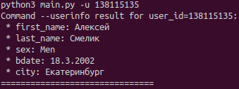

# vk_api_client
Simple client for VK API: https://dev.vk.com/reference. There are 3 commands: print `info about user` by `user id`,
print the `user's friends` or `user's albums` by `user id` with the ability to set the number of friends to display. 

_**The implementation is easily extensible and uses asynchronous requests to the api.**_

### The requirements must be set before use:
* python ~=3.8
```
python3 -m pip install -r requirements.txt
```
* `access token`, you can get it from the VK API instruction - https://dev.vk.com/api/access-token/getting-started.
When you get the token, put it in `settings.json` located in the root of the project.

**_You can run the utility with the -h flag to see how the parameters are passed:_**
```
python3 main.py -h
```

### Usage example:
```
python3 main.py -u 138115135
```

